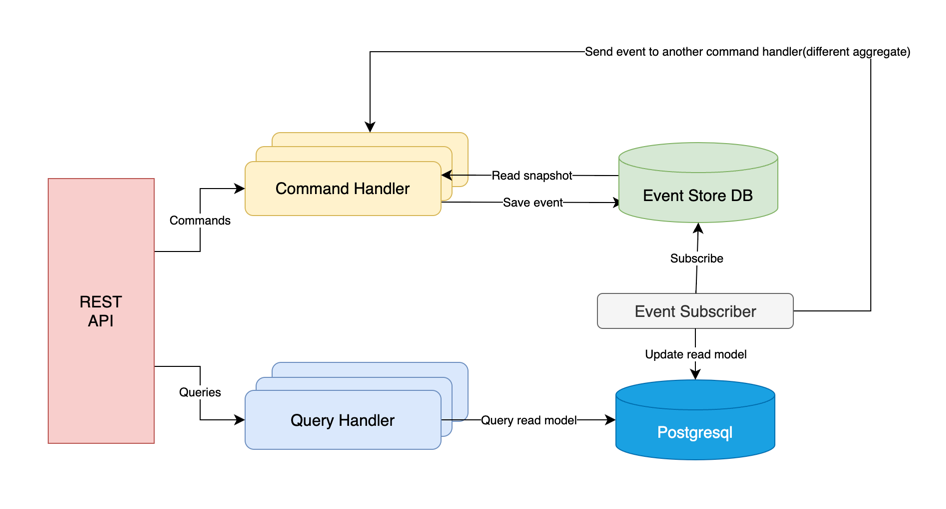
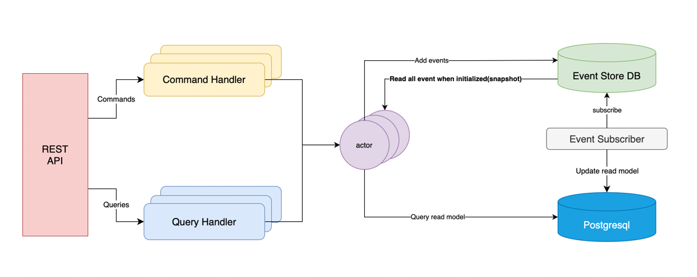

# Event Sourcing and CQRS 

# Actor Model

## Concept 
- A single actor(maybe an aggregate) handles all the commands and queries
## Pros 
- Concurrency handling is minimized because a single actor handles all the state changes
- Only a single snapshotting stream is needed for an aggregate(actor)
- Force the abstraction of an aggregate to be a single actor
- Distributed & Reactive by nature  

## Cons 
- Not easy concepts to grasp: CQRS + Event Sourcing + Actor model

# ETC 
- link: https://app.diagrams.net/#G1QhnY_w875VTU_rdFBfcBYtg-1Iff-2jO
